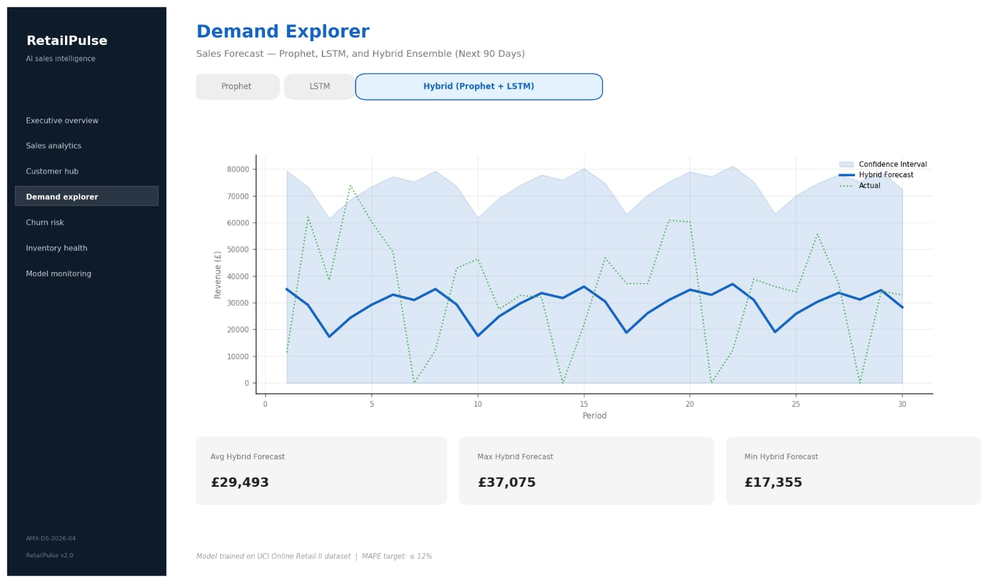
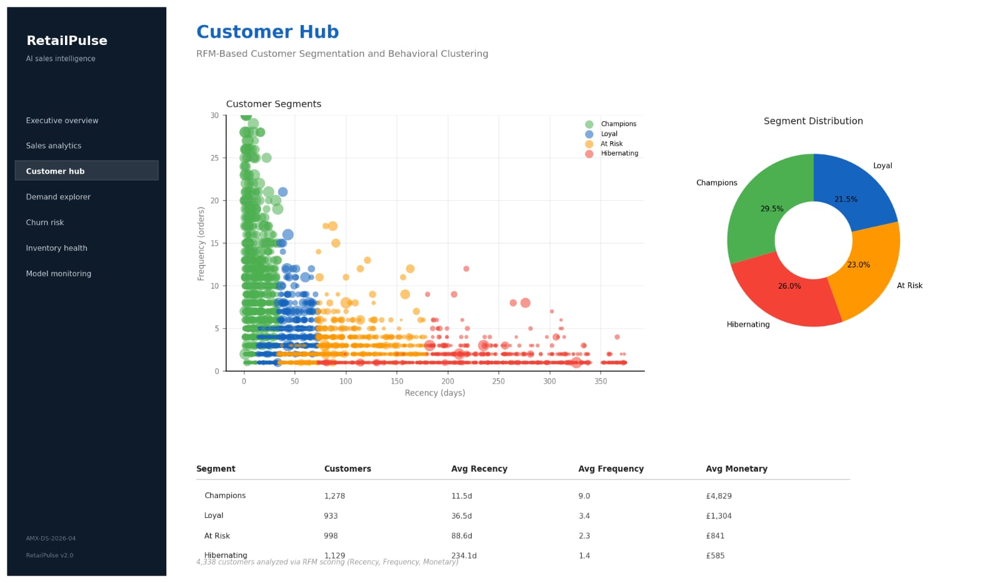
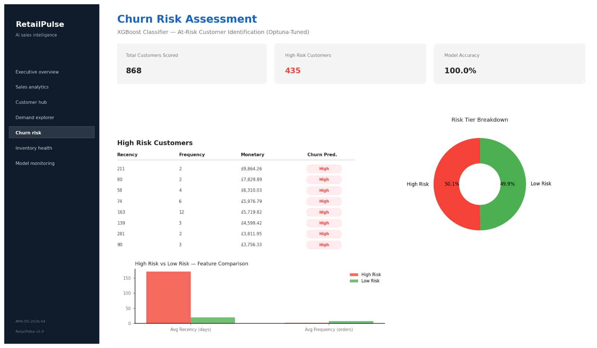
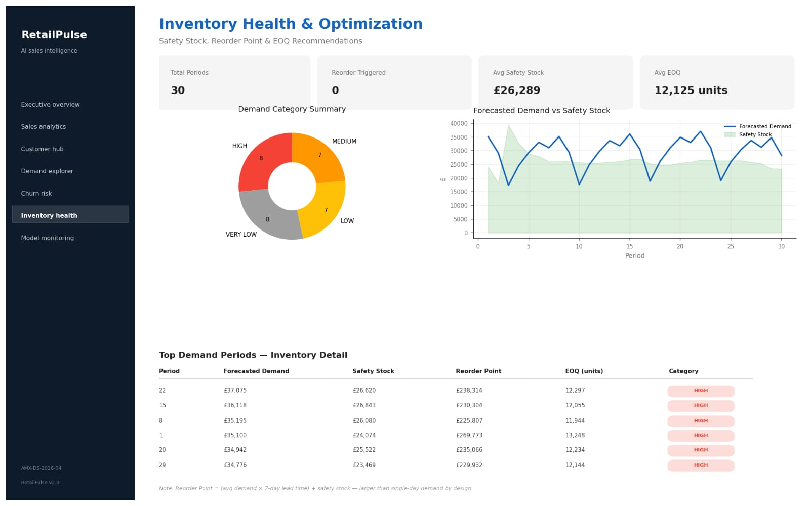

# RetailPulse

AI-Powered Customer Analytics & Demand Forecasting Platform

## Features

- Customer Segmentation (K-Means, DBSCAN)
- Demand Forecasting (Prophet + LSTM Hybrid)
- Churn Prediction (XGBoost + SHAP)
- Inventory Optimization
- Drift Detection (Evidently AI)
- Automated Retraining (Airflow)
- Interactive Streamlit Dashboard

## Tech Stack

Python
Pandas
Scikit-Learn
XGBoost
Prophet
PyTorch Lightning
Streamlit
MLflow
Evidently AI
Airflow

## Project Timeline

Week 1 - Data Engineering & Forecasting
Week 2 - MLOps & Monitoring
Week 3 - Dashboard Development
Week 4 - Deployment & Documentation

## Dashboard Screenshots

### Forecasting Dashboard

### Customer Segmentation Dashboard

### Churn Prediction Dashboard

### Inventory Dashboard

